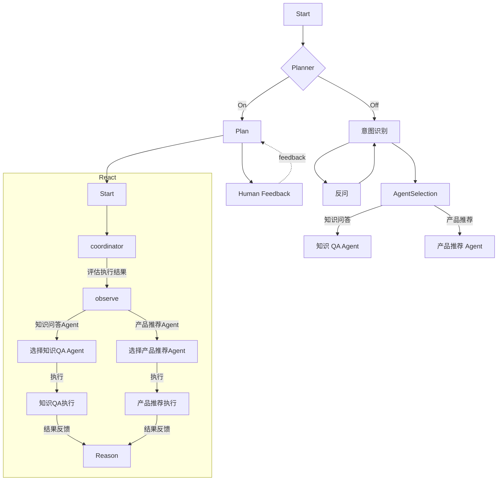

# 系统工作流程图

```mermaid
graph TD
    Start --> Planner{Planner}
    
    %% Planner 路径 - React 工作方式
    Planner -->|On| Plan[Plan]
    Plan --> HumanFeedback[Human Feedback]
    HumanFeedback -.->|feedback| Plan
    Plan --> PlannerAgent[Start]
    
    %% 直接进入意图识别路径
    Planner -->|Off| IntentRecognize[意图识别]
    
    %% 意图识别后的处理
    IntentRecognize --> AgentSelection
    AgentSelection -->|知识问答| KnowledgeQA[知识 QA Agent]
    AgentSelection -->|产品推荐| ProductRecommend[产品推荐 Agent]
    
    %% 意图无法识别时的处理
    IntentRecognize --> Clarify[反问]
    Clarify --> IntentRecognize
    
    %% React 循环细节 - 具象化Agent选择过程
    subgraph React
        PlannerAgent --> coordinator[coordinator]
        coordinator -->|评估执行结果| Observe[observe]
        Observe -->|知识问答Agent| SelectKnowledgeQA[选择知识QA Agent]
        Observe -->|产品推荐Agent| SelectProductRecommend[选择产品推荐Agent]
        SelectKnowledgeQA -->|执行| KnowledgeQAInternal[知识QA执行]
        SelectProductRecommend -->|执行| ProductRecommendInternal[产品推荐执行]
        KnowledgeQAInternal -->|结果反馈| Reason
        ProductRecommendInternal -->|结果反馈| Reason
    end
```
